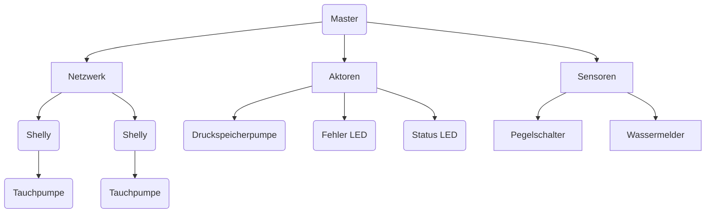

# Hauswasserwerk

___

Das Hauswasserwerk besteht aus mehreren Pumpen, welche beide über WiFi Smart Aktoren angesteuert werden.
Die Master-Einheit besteht aus einem Arduino Uno mit W5500 Ethernet Driver.

Die Konfigurationen werden jeweils auf den Geräten Lokal gespeichert, eine Steuerung wird über HomeAssistant
bereitgestellt.

## Todos:

- Telnet Server
- Automatische Befüllung des Pufferspeichers.
- Automatische Befüllung nach Vorrang.
- Fehlermeldung (Anhand Füllstand, bei BSPW. 10% Druckspeicherpumpe nicht mehr einschalten.)
- Fehlermeldung (Anhand Leistungsaufnahme)
- Füllstandüberwachung (Ultraschall)
- Wassermelder
- PUSH Benachrichtigungen

## Struktur:

## Abläufe:

### Druckspeicher:

1. Pumpe einschalten
2. Pumpe auf Leistungsaufnahme überwachen
3. Pumpe nach max. X (30) Sekunden abschalten und Fehlermeldung **(Eventuelle Leckage)** auslösen.
4. Pumpe abschalten.

### Tauchpumpen:

1. Pumpe auf Leistungsaufnahme überwachen.
    - Wenn Leistungsaufnahme verfügbar trotz ausschaltbefehl Fehlermeldung **(Relais klebt)**...
    - Wenn Leitungsaufnahme zu gering, Fehlermeldung auslösen **(Trockenlaufschutz ausgelöst)**
2. Pumpe einschalten
3. Pumpe abschalten