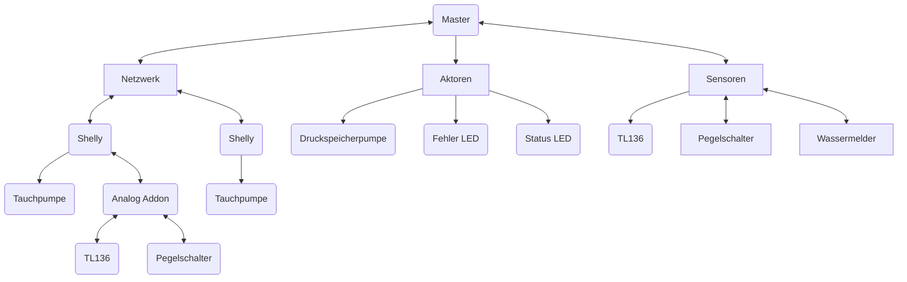
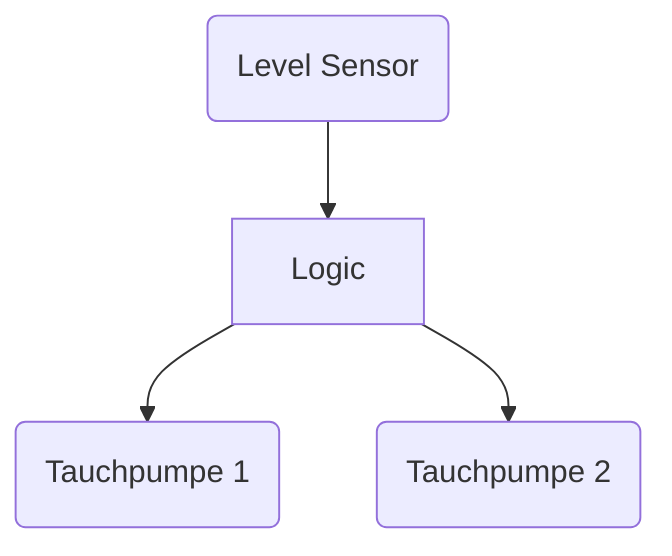

# Hauswasserwerk

___

Das Hauswasserwerk besteht aus mehreren Pumpen, welche beide über WiFi Smart Aktoren angesteuert werden.
Die Master-Einheit besteht aus einem Arduino Uno mit W5500 Ethernet Driver.

Die Konfigurationen werden jeweils auf den Geräten Lokal gespeichert, eine Steuerung wird über HomeAssistant
bereitgestellt.

## Todos:

STOP CHECKING SHELLY EVERY 15 SECONDS...
CHECK ONLY AFTER AN ACTION setSlave ... 3time or so...

- Telnet Server ✅ (Removed to save Calculation Power: https://github.com/Gamer08YT/Hauswasserwerk/commit/9cf62652142b0a99b1d55ce0b070886ef9a440bf)
- Automatische Befüllung des Pufferspeichers. ✅
- Automatische Befüllung nach Vorrang. (50%)
- Fehlermeldung (Anhand Füllstand, bei BSPW. 10% Druckspeicherpumpe nicht mehr einschalten.) ✅
- Fehlermeldung (Anhand Leistungsaufnahme)
- Füllstandüberwachung (Ultraschall) ✅
- Füllstandüberwachung (TL136) ✅
- Wassermelder
- PUSH Benachrichtigungen* ✅

*Via HA
## Struktur:

## Abläufe:

### Druckspeicher:

1. Pumpe einschalten
2. Pumpe auf Leistungsaufnahme überwachen
3. Pumpe nach max. X (30) Sekunden abschalten und Fehlermeldung **(Eventuelle Leckage)** auslösen.
4. Pumpe abschalten.

### Tauchpumpen:

1. Pumpe auf Leistungsaufnahme überwachen.
    - Wenn Leistungsaufnahme verfügbar trotz ausschaltbefehl Fehlermeldung **(Relais klebt)**...
    - Wenn Leitungsaufnahme zu gering, Fehlermeldung auslösen **(Trockenlaufschutz ausgelöst)**
2. Pumpe einschalten
3. Pumpe abschalten

## Mischen

## Flashen

GND —>    GND

TX —>    RX0 (nicht RXD!)

RX —>    TX0 (nicht TXD!)

5V —>    5V

GND -> IO0

## Pinout

Note 1: The module enables high levels by default.

Note 2: 3V3 and 5V power supply, the two can only choose one ！！！

Note 3: IO39, IO35 and IO36, only supports input.

#### Debugging:

Remove Sensor Data:
apk add --no-cache sqlite
sqlite3 home-assistant_v2.db
`DELETE FROM states WHERE entity_id="sensor.wasserwerk_fullstand_puffer";`